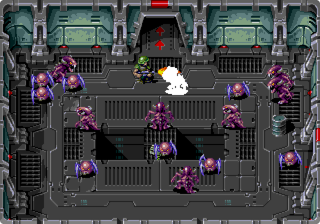
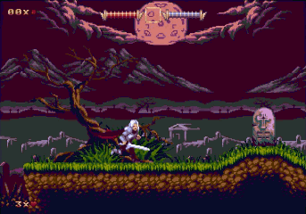

# SGDK 1.80 (september 2022)
#### Copyright 2022 Stephane Dallongeville
Patreon: https://www.patreon.com/SGDK 
Github: https://github.com/Stephane-D/SGDK

**SGDK** is a free development kit allowing development of software in **C language** for the **Sega Mega Drive**.
It contains the development library itself (with the code sources) and some custom tools used to compile resources.
SGDK uses the GCC compiler (m68k-elf target) and the libgcc to generate a ROM image. Binaries (GCC 6.3) are provided for Windows OS for convenience, but you need to install it by yourself for other operating systems.
Note that SGDK also requires Java (custom tools require it), so you need to have Java installed on your system.

SGDK library and custom tools are distributed under the MIT license (see [license.txt](license.txt) file).
GCC compiler and libgcc are under GNU license (GPL3) and any software build from it (as the SGDK library) is under the GCC runtime library exception license (see [COPYING.RUNTIME](COPYING.RUNTIME) file)
 
## GETTING STARTED

First, you need to know that SGDK uses the C language (assembly is also possible, but not necessary) so it's highly recommended to be familiar with C programming before trying to develop with SGDK. Learning C language at same time as learning 'Sega Mega Drive' programming is definitely too difficult and you will end up getting nowhere. It's also important to have, at least, a basic knowledge of the Sega Mega Drive hardware (specifically the video system). 

### MEGA DRIVE TECHNICAL INFO REFERENCES

* And-0 - Awesome Mega Drive Development references: 
https://github.com/And-0/awesome-megadrive
* Raster Scroll - Sega Mega Drive Graphics guide: 
https://rasterscroll.com/mdgraphics/
* Mega Cat Studios - Sega Mega Drive graphics guide: 
https://megacatstudios.com/blogs/retro-development/sega-genesis-mega-drive-vdp-graphics-guide-v1-2a-03-14-17
* Sik's Blog dedicated to MD assembly programming but explain a lot of stuff (and in a nice way) about the Sega Mega Drive hardware: 
https://plutiedev.com
* A nice article from Rodrigo Copetti explaining the Mega Drive architecture: 
https://www.copetti.org/projects/consoles/mega-drive-genesis
* Genesis Software Manual which contains absolutely everything you need to know about the Sega Mega Drive: 
https://segaretro.org/images/a/a2/Genesis_Software_Manual.pdf

### INSTALLATION AND DOCUMENTATION 

Then when you feel ready you can go further and finally install SGDK :)

You can find installation instructions and tutorials about how use SGDK on the wiki: 
https://github.com/Stephane-D/SGDK/wiki

SGDK comes with doxygen documentation (generated from .h header files) which provides descriptions about SGDK structures and functions. You can find it in the _'doc'_ folder (open your local _doc/html/files.html_ in your browser).

It's important to know that SGDK heavily relies on _resources_ which are compiled through the _rescomp_ tool. You should read the [rescomp.txt](https://raw.githubusercontent.com/Stephane-D/SGDK/master/bin/rescomp.txt) file to understand **which kind of resources you can use and how to declare them**. Then you can look at the *'sample'* folder from SGDK and, in particular, the [sonic sample](https://github.com/Stephane-D/SGDK/tree/master/sample/sonic) which is a good showcase of SGDK usage in general (functions and resources).

### OTHERS TUTORIALS

You can find a lot of tutorials online about SGDK but be careful, some are outdated or sometimes just wrong. 
I really recommend starting from the [wiki](https://github.com/Stephane-D/SGDK/wiki) which provides the basics to start, but if you need more _visual_ and more complete tutorials you can give either of these a try: 
MD programming tutorials from Ohsat: 
https://www.ohsat.com/tutorial/mdmisc/creating-graphics-for-md/ 
Very complete and visual tutorials from Danibus (spanish only): 
https://danibus.wordpress.com/ 

### USEFUL TOOLS

Here's a list of useful tools to help you creating your assets:

#### Pixel art / Sprite

* [Asesprite](https://www.aseprite.org/)
* [Graphics gale](https://graphicsgale.com/)
* [Pro Motion](https://www.cosmigo.com/)
* [Grafx2](http://grafx2.chez.com/)
* [Palette quantizer](https://rilden.github.io/tiledpalettequant/): powerful tool to convert your image with palette palette constraints

#### Map / Level

* [16Tile](https://allone-works.itch.io/16tile): SGDK specific tile map editor
* [Tiled](https://www.mapeditor.org/): Tile map editor, supported by SGDK resource compiler tool
* [LDTK](https://deepnight.net/tools/ldtk-2d-level-editor/): New but powerful tile map editor (support Tiled formats as well)
* [Ogmo](https://ogmo-editor-3.github.io/): Another tile map editor

#### Music / sound

* [Deflemask](https://www.deflemask.com/): music tracker supporting several system as the Sega Mega Drive
* [Furnace](https://github.com/tildearrow/furnace): new music tracker supporting many systems
* [Wavosaur](https://www.wavosaur.com/): wave sound editor (windows only)
* [Audacity](https://www.audacityteam.org/): wave sound editor (all OS)
 
## HELP AND SUPPORT

If you need help or support with SGDK, you can join the SGDK Discord server: 
https://discord.gg/xmnBWQS

You can also go to the Spritesmind forum which is dedicated to Sega Mega Drive development and has a specific section for SGDK: 
http://gendev.spritesmind.net/forum/
 
### MACOSX / LINUX

Unix/Linux users should give this very simple script a try, allowing you to use SGDK from Wine easily: 
https://github.com/Franticware/SGDK_wine

There is also a new solution proposed by Daniel Valdivieso to use SGDK with VSCode under any OS using Wine: 
https://github.com/v4ld3r5/sgdk_vscode_template

Another great alternative is to use the complete _MarsDev_ environment developed by Andy Grind:
https://github.com/andwn/marsdev
It suppots all OSes, provides SGDK compatibility as well as 32X support, so be sure to check it out.

MacOSX users also have access to SGDK with Gendev for MacOS from the Sonic3D project: 
https://github.com/SONIC3D/gendev-macos

### DOCKER

*A modern way to install it on any environement is to use Docker.*

To build the `sgdk` base image:

    docker build -t sgdk .

To build the `sgdk` base image on mac with m1 chip:

    docker build -t sgdk --file Dockerfile-m1 .

And then to compile the local env, such as `samples` for example:

    cd sample/sonic
    docker run --rm -v "$PWD":/src sgdk

Notes:

- `$PWD` will not work on Windows, `%CD%` has to be used instead.
- To avoid writing `./out` files as root, execute the docker command as current user:
  `docker run --rm -v "$PWD":/src -u $(id -u):$(id -g) sgdk`
- You can also try the alternate Doragasu docker solution which uses a native linux compiler (much faster):
  https://gitlab.com/doragasu/docker-sgdk
 
### VISUAL STUDIO

You can find a Visual Studio template in the 'vstudio' folder to facilate SGDK integration with VS.
Or, to take it even further, you can also install the VS extension made by zerasul: 
https://marketplace.visualstudio.com/items?itemName=zerasul.genesis-code
 
## SUPPORT SGDK

SGDK is completly free but you can support it on Patreon: https://www.patreon.com/SGDK

## THANKS

- Doragasu for the multi-tasking engine (based on Sik implementation), MegaWifi, flash save support and others nice additions.
- Sik for the multi-tasking base implementation and for all its unvaluable Plutidev Sega Mega Drive technical information source. 
- Chilly Willy for making almost all the JOY / controller support in SGDK (and the joy test sample ^^).
- Astrofra for the starfield donut sample and the revamped readme ;)
- Gligli for building and providing GCC 6.3 for Windows.
- Gunpog for making the new SGDK logo.
- Vojtěch Salajka for the script allowing to use SGDK easily from Wine (Linux/Unix but may work on OSX too).
- Daniel Valdivieso for another Wine based solution to use SGDK on multi-OS (including a VSCode template).
- Andy Grind for the MarsDev project allowing to use SGDK on any OS and also supporting 32X dev.
- Kubilus for the GenDev Linux port of SGDK.
- Sonic3D for the GenDev OSX port of SGDK.
- Vladimir Kryvian for Visual Studio support and template.
- Steve Schnepp for Docker support.
- Andreas Dietrich for the nice Wobbler & scaling effect samples.
- clbr for various contributions.
- jgyllinsky for providing / improving build batches.
- nolddor for fixes / contributions.
- starling13 for fixes.
- davidgf for its contributions (improved assembly LTO optimization).
- ShiningBzh / Jeremy and Kentosama for their precious help in testing.
- Vetea and Studio Vetea Discord people in general for their support and kindness.
- all those i forgot and generally all people helping by providing support, reporting bugs, adding samples and supporting SGDK in any way !

## SPECIAL THANKS

Of course I thank all my patreon for their continuous support but I want to dedicace a very special and warmfull thanks for generous donation from:

- Bitmap Bureau (Xeno Crisis team)
- Neofid Studios (Demons of Asteborg team)
- Dmitry (D I)
- Rajen Savjani

## POWERED BY THE SGDK!

These projects are known to be based on the SGDK _(non-exhaustive list)_:

 
Tanzer by [Mega Cat Studios](https://megacatstudios.com/products/tanzer-sega-genesis)

 
MASIAKA by [Resistance](https://www.pouet.net/prod.php?which=71543)

 
Xeno Crisis by the [Bitmap Bureau](https://www.bitmapbureau.com/)

 
Demons of Asteborg [Neofid Studios](https://neofid-studios.com/)

### Random list of SGDK-powered games and demos

* [2048](https://github.com/atamurad/sega-2048) by atamurad
* [Abbaye des Morts (l')](https://playonretro.itch.io/labbaye-des-morts-megadrivegenesis-por-002) unofficial MD port by Moon-Watcher
* [Art of LeonBli (the)](https://www.pouet.net/prod.php?which=72272) by Resistance
* [Barbarian](https://www.youtube.com/watch?v=e8IIfNLXzAU) unofficial MD port by Z-Team
* [Demons of Asteborg](https://demonsofasteborg.com/) by Neofid Studio
* [Devwill Too MD](https://amaweks.itch.io/devwill-too-md) by Amaweks
* [Fatal Smarties](https://globalgamejam.org/2016/games/fatal-smarties) made for the GGJ 2016
* [Fullscreen NICCC 2000](https://www.pouet.net/prod.php?which=81136) by Resistance
* [IK+ Deluxe](https://www.youtube.com/watch?v=mcm0TRsOwuw) unofficial MD port by Z-Team
* [Irena](https://white-ninja.itch.io/irena-genesis-metal-fury) by White Ninja Studio
* [Omega Blast](https://nendo16.jimdofree.com/omega-blast/) by Nendo
* [Perlin & Pinpin](https://lizardrive.itch.io/perlin-pinpin-episode1) by Lizardrive
* [Right 2 Repair](https://supermegabyte.itch.io/right-2-repair) by Super Megabyte made for the GGJ 2020
* [Return to Genesis](https://www.youtube.com/watch?v=jjy0Iz_64dY) unofficial MD port by Z-Team
* [Road to Valhalla](https://www.pouet.net/prod.php?which=72961) by Bounty/Banana & Resistance
* [Spiral (the)](https://www.pouet.net/prod.php?which=82607) by Resistance
* [TCK](https://www.cursed-knight.fr/cursed-knight-fr.php) by GGS Studio Creation
* [Tetris MD](https://github.com/NeroJin/TetrisMD) unofficial MD port by Nero Jin
* [ThunderCats MD](https://github.com/mxfolken/thundercats_megadrive) by Rolando Fernández Benavidez.
* [Travel](https://www.pouet.net/prod.php?which=65975) by Resistance
* [Wacky Willy Weiner Sausage Surfer](https://globalgamejam.org/2017/games/wacky-willy-weiner-sausage-surfer) made for the GGJ 2017
